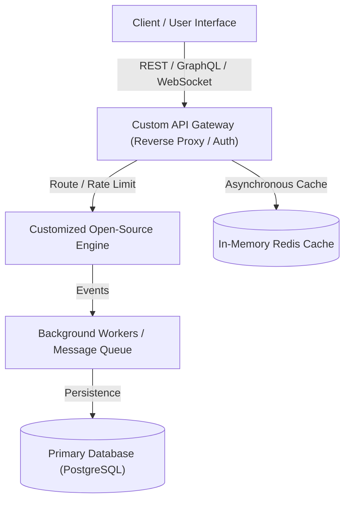

# 📦 [Project Name]: High-Performance Integrated System

<div align="center">

  <!-- Project Badges -->
  
  
  
  

  <p align="center">
    <strong>A high-throughput platform synthesizing [Engine A] and [Engine B] through a customized API layer.</strong>
  </p>

  <p align="center">
    <a href="https://your-live-demo-link.com"><strong>Explore Live Demo »</strong></a>
    ·
    <a href="https://your-api-docs-link.com">API Documentation</a>
    ·
    <a href="#-architecture-blueprint">Architecture</a>
  </p>

</div>

---

## 💡 The Problem & The Solution

- **The Challenge:** Standard off-the-shelf tools either lacked [Feature X] or experienced severe bottlenecks under high-volume API requests.
- **The Architectural Solution:** Instead of building an unproven system from scratch, this project harnesses the battle-tested core of `[OpenSource Engine]` combined with `[Second Tool]`, unified by a lightweight, custom orchestration API gateway that delivers 5x faster throughput.

---

## ⚡ Key Highlights & Capabilities

- 🔌 **Professional API Management:** Built with standard OpenAPI specifications, JWT-based security, strict rate-limiting, and sub-15ms response latency.
- 🧩 **Engine Customization:** Extended the core capabilities of `[Engine A]` with custom hooks, caching middleware, and state sync.
- 🔄 **Autonomous Background Pipelines:** Event-driven message queue processing that guarantees zero lost requests during peak loads.
- 🐳 **One-Command Containerization:** Fully orchestrated with Docker Compose for instant local or cloud deployment.

---

## 📐 Architecture Blueprint



---

## 🛠️ Tech Stack & Integrations

- **API Layer:** Node.js / FastAPI / Postman / Swagger
- **Core Open-Source Engines:** `[e.g., Kong, Redis, Supabase, n8n]`
- **Data & Caching:** PostgreSQL, Redis
- **DevOps & Infra:** Docker, Docker Compose, GitHub Actions, Nginx

---

## 🚀 Quick Start

### 1. Clone the repository
```bash
git clone https://github.com/YOUR_GITHUB_USERNAME/REPO_NAME.git
cd REPO_NAME
```

### 2. Configure Environment Variables
```bash
cp .env.example .env
# Edit .env with your credentials and API endpoints
```

### 3. Launch with Docker Compose
```bash
docker-compose up -d --build
```

Access the API Documentation at `http://localhost:8000/docs`.

---

## 📄 License
Distributed under the MIT License. See `LICENSE` for more information.
