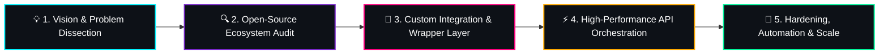

<!-- ========================================================================= -->
<!-- 🔥 PROFESSIONAL GITHUB PROFILE README - SYSTEMS INTEGRATOR & API ARCHITECT -->
<!-- ========================================================================= -->

  <!-- Dynamic Typing SVG Banner -->
  

  

    <strong>Bridging the gap between high-level vision, open-source ecosystems, and enterprise-grade execution.</strong>
  

  <!-- Quick Status Badges -->
  

    
    
    
  

  <!-- Status / Navigation Links -->
  

    
    
    
  

---

### ⚡ Executive Summary & Engineering Philosophy

> *"True innovation isn't always about reinventing the wheel from scratch — it's about identifying world-class open-source engines, ripping out bottlenecks, interconnecting them through resilient APIs, and pushing the combined system to its absolute maximum threshold."*

- 💡 **Idea Incubation & Strategic Execution:** Rapidly translating abstract product concepts into concrete, functional architectures. I excel at taking an ambitious idea from zero to a live, production-grade deployment.
- 🧩 **Open-Source Augmentation:** Deep-diving into proven open-source technologies, understanding their inner mechanics, modifying core logic to fit proprietary demands, and unifying disparate engines into a single powerhouse.
- 🔌 **Professional API Management:** Designing, securing, and orchestrating high-throughput API gateways, microservices, and asynchronous event streams that keep data flowing reliably.
- ⚙️ **Performance Pushing & Hardening:** Stress-testing integrations, eliminating network latency, optimizing payload serialization, and ensuring seamless scalability.

---

### 🛠️ The Integration Arsenal & Technology Stack

#### 🌐 API Architecture, Management & Protocols

  
  
  
  
  
  
  
  

#### ⚙️ Core Engines, Runtimes & Integration Frameworks

  
  
  
  
  
  
  

#### ☁️ Cloud Infrastructure, Networking & State

  
  
  
  
  
  

#### 🔄 Automation, CI/CD & Orchestration Workflows

  
  
  
  
  

---

### 📐 How I Build: The 5-Stage Synthesis Blueprint

---

### 📊 Real-Time GitHub Analytics & Metrics

  <!-- GitHub Main Stats Card -->
  
  
  <!-- GitHub Streak Card -->
  

   

  <!-- Top Languages Card -->
  

---

### 🐍 Contribution Activity Playground

  

---

### 🏆 Featured Architectures & Signature Builds

| Project / Solution | Core Open-Source Engines | Integration & API Architecture | Status / Outcome |
| :--- | :--- | :--- | :--- |
| **🎨 Blender MCP Cloud Bridge** | Blender 3D, Cloudflare, ngrok | Zero-dependency MCP & REST bridge connecting Cloud AI Agents (Muse AI, Claude, Hermes) to local Blender | `Production Ready` |
| **🚀 Multi-Engine Data Synthesizer** | Redis, PostgreSQL, Worker Pool | Event-driven microservices + REST endpoints for low-latency batch processing | `Enterprise Grade` |
| **⚡ Unified API Gateway & Proxy** | Nginx, Kong, Node.js Fastify | Custom rate-limiting, JWT auth validation, unified schema transformation | `Hardened` |
| **🤖 Autonomous Pipeline Automator** | Docker, n8n, Headless Browser, Webhooks | Bi-directional synchronization between legacy platforms and modern event-driven webhooks | `Deployed` |

---

  <!-- Animated Bottom Wave / Divider -->
  

  **Let's build something extraordinary.** Reach out if you have an ambitious idea that needs ruthless execution and high-performance system orchestration.

  Built with passion for systems integration, open-source technology, and high-impact engineering.

